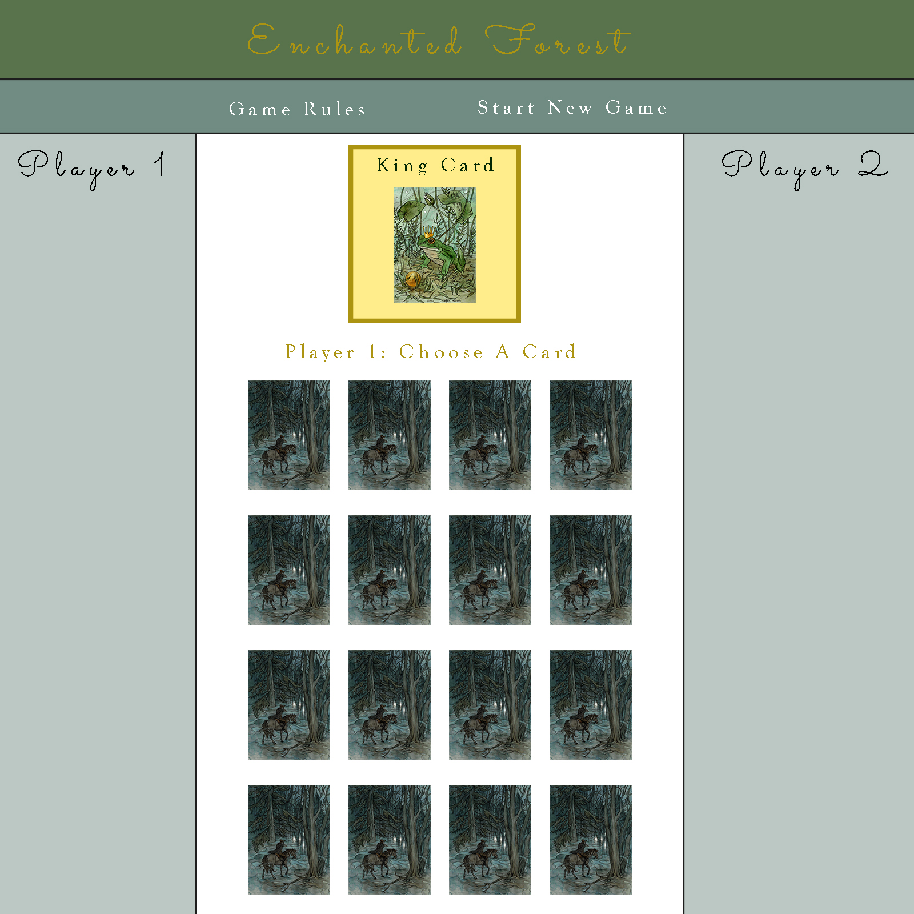
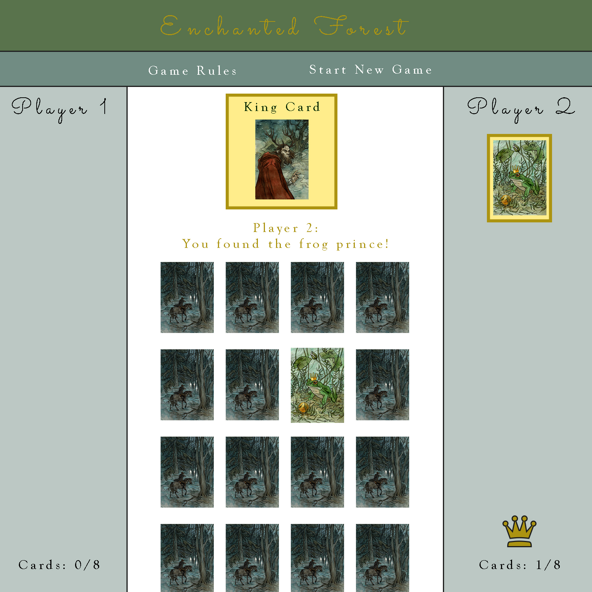
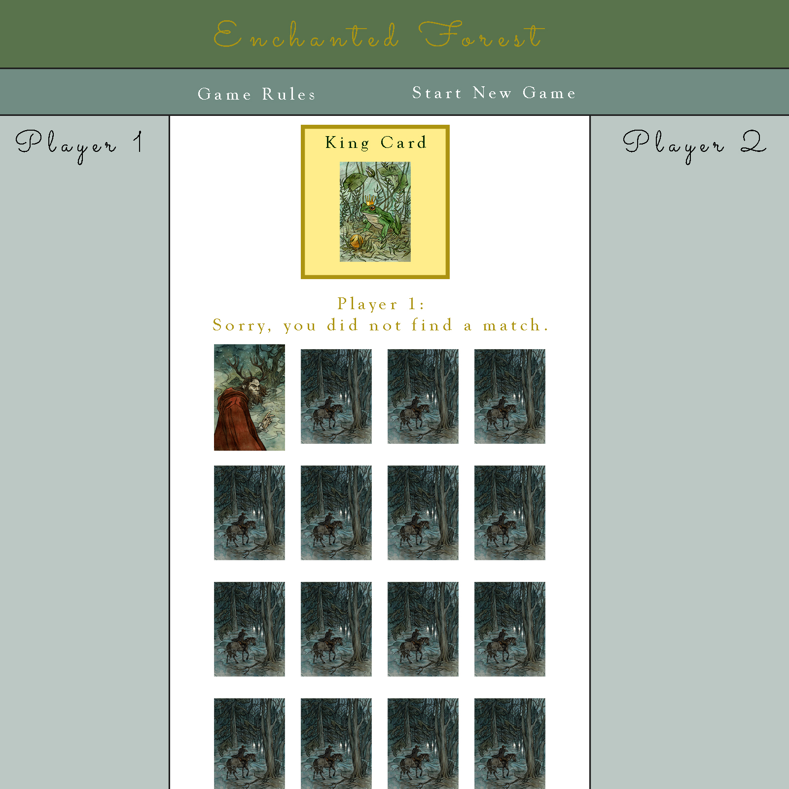
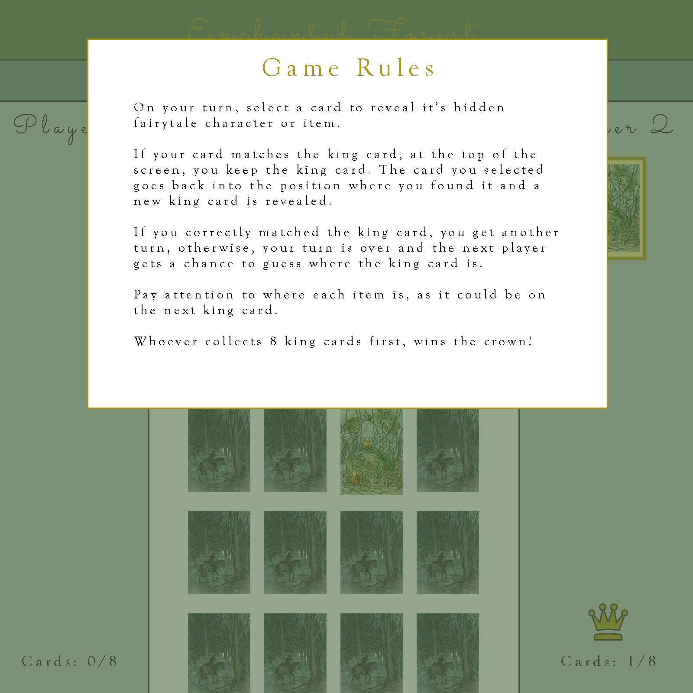

# Enchanted Forest

A card game that requires players to remember the locations of fairytale treasures. Based on the board game of the same name, published by Ravensburger in Germany in 1981.

## Technology Used

* Front-End: HTML, CSS, JavaScript, Vue.js
* Database: MongoDB / mongoose
* Back-End: Node.js / Express.js

## Deployment

* Deployed on Heroku: https://enchanted-forest.herokuapp.com/

## Inspiration

I was inspired to build this project for a number of reasons.

First, my favorite thing to develop is game logic. I love the challenge and the puzzle-solving aspect of it. To me, building a game is more fun than playing it.

My second favorite part of development is front-end design and animation. What better way to flex my designer and animator muscles than by building a card game with a fairytale theme? The design and animation potential is endless! My favorite effect is the shuffle animation when the player clicks "Start New Game".

Finally, there is a bit of a nostalgia factor. Enchanted Forest was my favorite board game as a kid. It is fairly easy to learn and while it requires a bit of mental concentration, it is accessible to any age group. I always loved the beautiful illustrations on the board and cards and wanted to bring that artistic element to my game as well.

While I love design, I'm not an artist myself, but I was fortunate enough to find an artist who's work was a perfect fit for the ascetic I wanted the game to have.

## Acknowledgments

I would like to give a special thank you to artist, Liiga Klavina, for giving me permission to use her artwork on the game cards. I feel her artwork is really what makes my game special and I can't thank her enough for her lovely work.

You can see more of her artwork online at the following links:

* DeviantArt: https://www.deviantart.com/liigaklavina/gallery
* Instagram: https://www.instagram.com/liigaklavina
* Facebook: https://www.facebook.com/liigaklavinaillustrations/
* Society6: https://society6.com/lgakavia/s?q=popular+prints

## Mockups

## User Stories - This is my MVP

1. When a user lands on the homepage a new game board should be set up (with a randomly generated king card and game cards displayed face down in a random order).
2. A user should be able click a button to see game rules.
3. A user should be able to click a button to start a new game (shuffle cards and generate random king card).
3. A user should see the target or king card displayed at the top of the board.
4. A user should be able to click on a game card to flip it over and reveal a unique image.
5. If the card is a match (same as king card), they should get a point, the card should be added to their hand, they should get to play again, and a new king card should be revealed.
6. If the card is not a match, the turn should switch to the next player.
7. If a player is in the lead this should be indicated visually.
8. Once a player obtains 8 king cards, they are declared the winner and the game is over.
9. A user should be able to register an account and log in to see an authenticated view.
10. If authenticated, player 1 will be the user's name and a record of wins and loses will be maintained.
11. If authenticated, a player can click a button to see all their stats.

## Stretch Goals - These are updates I plan to make in the future

1. A player can set the number of cards they want to play to.
2. A player can choose to play 1 player or 2 player mode.
3. A player can choose to play against a computer on beginner, intermediate, or expert mode:
	* Beginner mode would mean the computer picks cards at random.
	* Intermediate mode would mean the computer remembers if it has seen a card before and will pick the correct card 50% of the time.
	* Expert mode would mean that if the computer has seen the card before, it will choose the correct card 100% of the time.
4. A player can play against a friend who is also registered on the site. The player 2 will become the friend's name and their score will also be recorded.
5. An admin sign in will allow me to delete, update and add cards from the front end. 	
